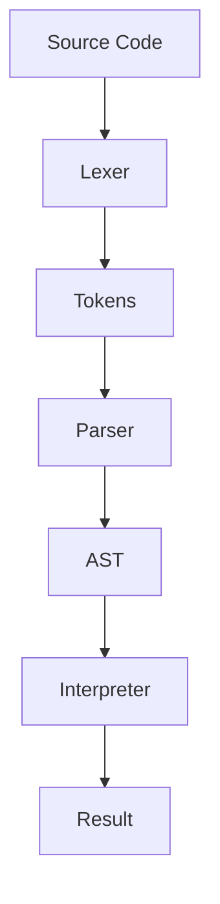
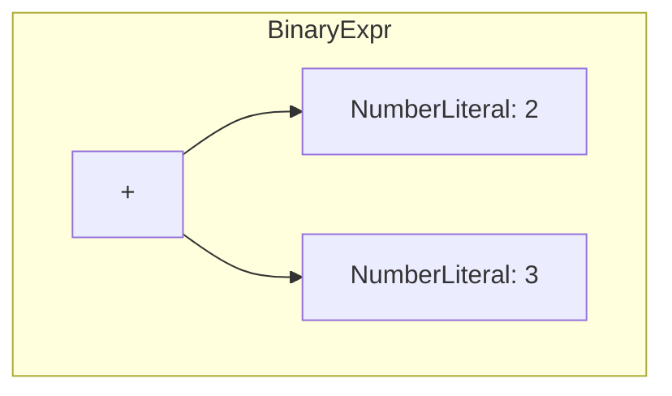
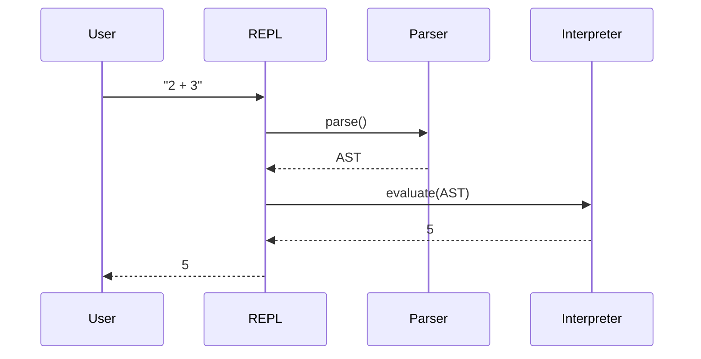
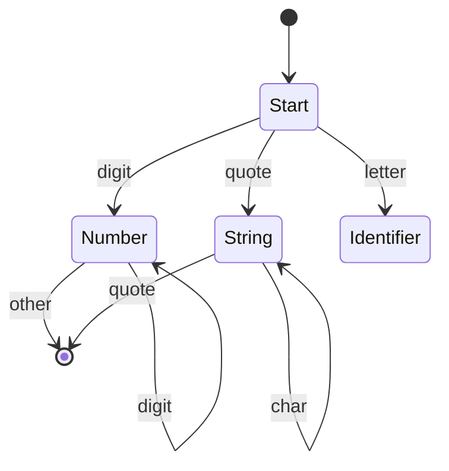
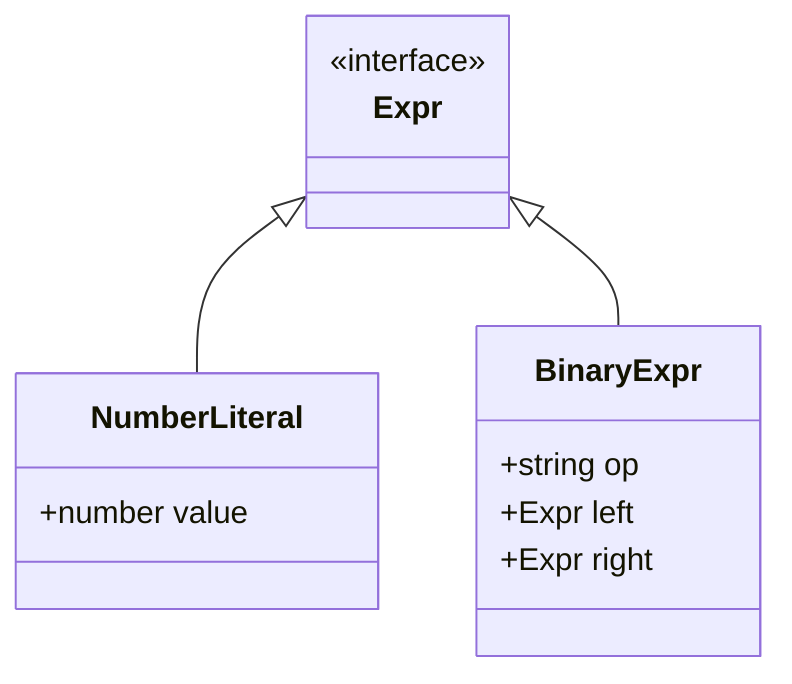
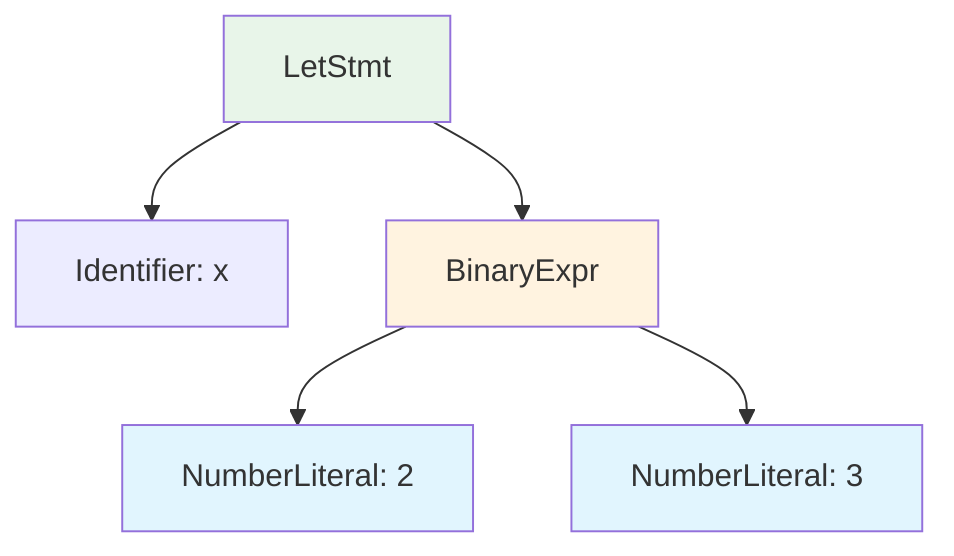

# Mermaid Diagram Best Practices

## Quick Start



## Diagram Types

### Flowchart (AST Visualization)



### Sequence Diagram (Execution Flow)



### State Diagram (Token States)



### Class Diagram (AST Types)



## AST Node Styling



## Generating from Code

```typescript
function astToMermaid(node: Expr, id = "n0"): string {
  const lines: string[] = [];

  function visit(node: Expr, nodeId: string): void {
    switch (node.type) {
      case "NumberLiteral":
        lines.push(`    ${nodeId}["${node.value}"]`);
        break;
      case "BinaryExpr":
        lines.push(`    ${nodeId}["${node.op}"]`);
        const leftId = `${nodeId}L`;
        const rightId = `${nodeId}R`;
        lines.push(`    ${nodeId} --> ${leftId}`);
        lines.push(`    ${nodeId} --> ${rightId}`);
        visit(node.left, leftId);
        visit(node.right, rightId);
        break;
    }
  }

  visit(node, id);
  return `flowchart TD\n${lines.join("\n")}`;
}
```

## HTML Embedding

```html
<!DOCTYPE html>
<html>
<head>
  <script src="https://cdn.jsdelivr.net/npm/mermaid/dist/mermaid.min.js"></script>
</head>
<body>
  <div class="mermaid">
    flowchart TD
      A --> B
  </div>
  <script>mermaid.initialize({ startOnLoad: true });</script>
</body>
</html>
```

## Reference Files

- [references/syntax.md](references/syntax.md) - Complete Mermaid syntax
- [references/theming.md](references/theming.md) - Custom themes and styles
