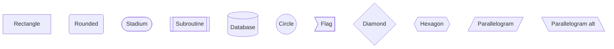
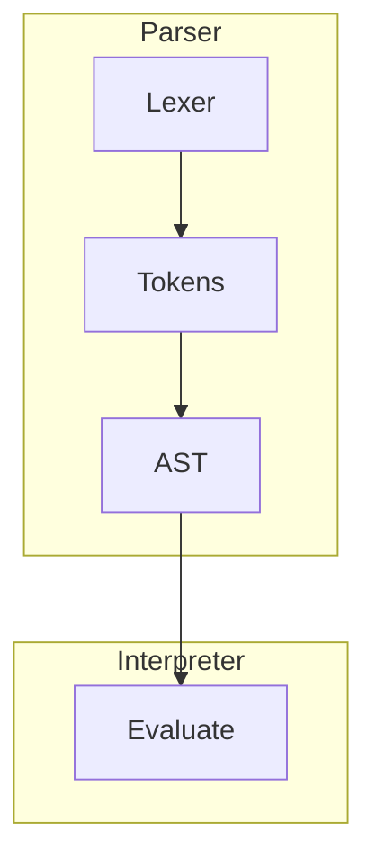
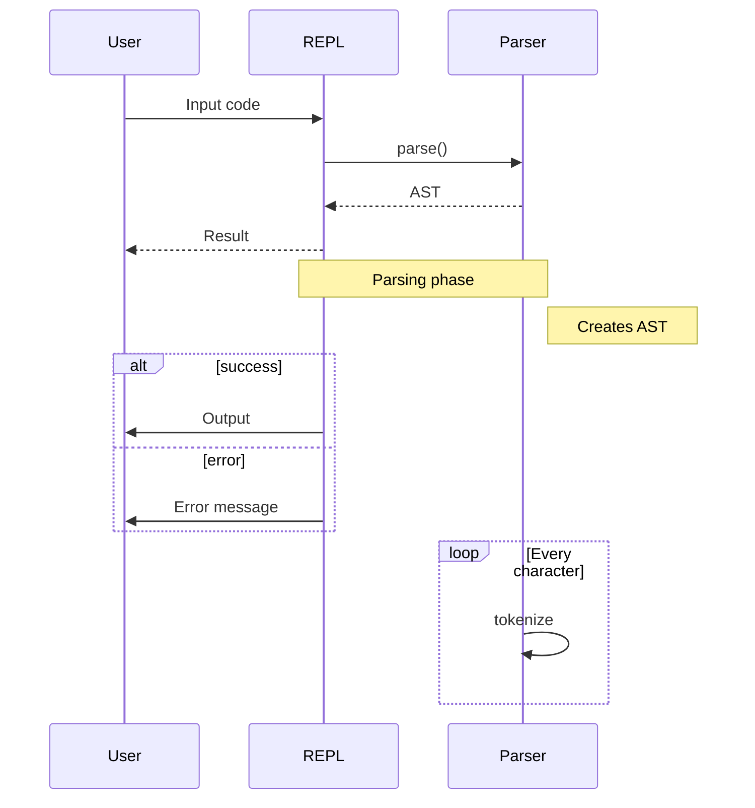
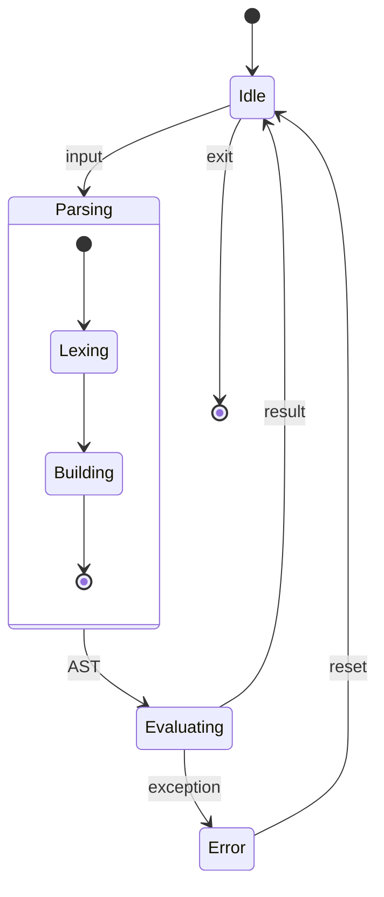
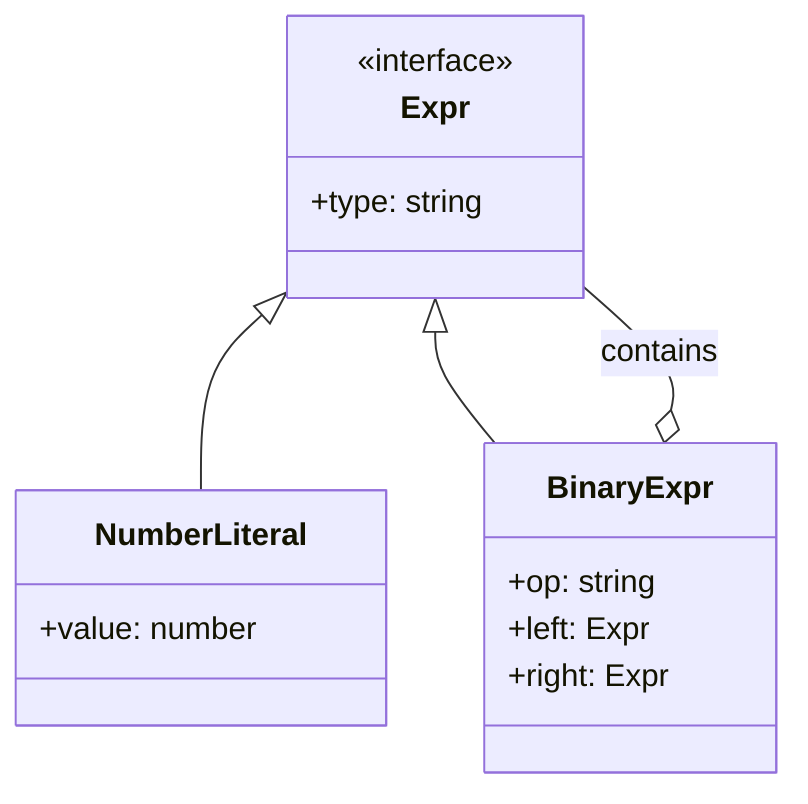
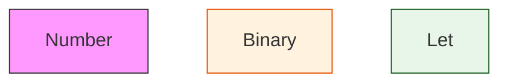

# Mermaid Syntax Reference

## Flowcharts

### Direction

```mermaid
flowchart TD  %% Top to Down
flowchart TB  %% Top to Bottom (same as TD)
flowchart BT  %% Bottom to Top
flowchart LR  %% Left to Right
flowchart RL  %% Right to Left
```

### Node Shapes



### Links

```mermaid
flowchart TD
    A --> B           %% Arrow
    A --- B           %% Line
    A -.- B           %% Dotted
    A -.-> B          %% Dotted arrow
    A ==> B           %% Thick arrow
    A -- text --> B   %% With text
    A -->|text| B     %% Alt text syntax
```

### Subgraphs



## Sequence Diagrams



### Arrow Types

```
->    Solid line without arrow
-->   Dotted line without arrow
->>   Solid line with arrowhead
-->>  Dotted line with arrowhead
-x    Solid line with cross
--x   Dotted line with cross
-)    Solid line with open arrow
--)   Dotted line with open arrow
```

## State Diagrams



## Class Diagrams



## Styling


