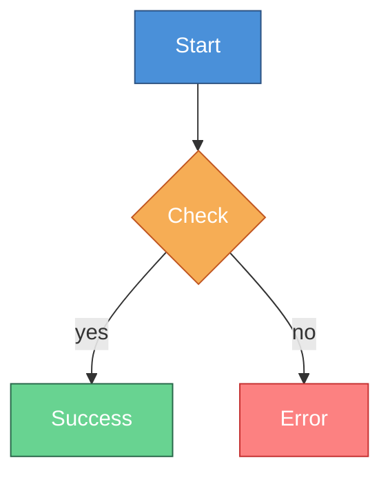

# Mermaid Themes and Styling

## Built-in Themes

```javascript
mermaid.initialize({
  theme: "default",    // Light theme
  // theme: "dark",    // Dark theme
  // theme: "forest",  // Green theme
  // theme: "neutral", // Grayscale
  // theme: "base",    // For customization
});
```

## Theme Variables

```javascript
mermaid.initialize({
  theme: "base",
  themeVariables: {
    // Primary colors
    primaryColor: "#4a90d9",
    primaryTextColor: "#fff",
    primaryBorderColor: "#2c5282",

    // Secondary colors
    secondaryColor: "#f6ad55",
    tertiaryColor: "#68d391",

    // Background
    background: "#ffffff",
    mainBkg: "#f7fafc",

    // Lines
    lineColor: "#4a5568",

    // Text
    textColor: "#2d3748",

    // Fonts
    fontFamily: "monospace",
    fontSize: "14px",
  },
});
```

## Flowchart Specific

```javascript
themeVariables: {
  // Nodes
  nodeBorder: "#2c5282",
  nodeTextColor: "#2d3748",

  // Clusters/Subgraphs
  clusterBkg: "#e2e8f0",
  clusterBorder: "#a0aec0",

  // Edges
  edgeLabelBackground: "#ffffff",
}
```

## Sequence Diagram Specific

```javascript
themeVariables: {
  // Actors
  actorBkg: "#4a90d9",
  actorTextColor: "#ffffff",
  actorBorder: "#2c5282",

  // Signals
  signalColor: "#4a5568",
  signalTextColor: "#2d3748",

  // Notes
  noteBkgColor: "#fef3c7",
  noteTextColor: "#92400e",
  noteBorderColor: "#d97706",

  // Loops
  labelBoxBkgColor: "#e2e8f0",
  labelBoxBorderColor: "#a0aec0",
}
```

## CSS Classes



## Inline Styles

```mermaid
flowchart TD
    A[Node A]
    B[Node B]

    style A fill:#4a90d9,stroke:#2c5282,color:#fff
    style B fill:#68d391,stroke:#276749,color:#fff,stroke-width:2px

    linkStyle 0 stroke:#f6ad55,stroke-width:2px
```

## Dark Mode Theme

```javascript
mermaid.initialize({
  theme: "base",
  themeVariables: {
    background: "#1a202c",
    mainBkg: "#2d3748",
    primaryColor: "#4a90d9",
    primaryTextColor: "#e2e8f0",
    lineColor: "#718096",
    textColor: "#e2e8f0",
    nodeBorder: "#4a5568",
  },
});
```

## HTML Integration

```html
<!DOCTYPE html>
<html>
<head>
  <script src="https://cdn.jsdelivr.net/npm/mermaid/dist/mermaid.min.js"></script>
  <script>
    mermaid.initialize({
      startOnLoad: true,
      theme: "base",
      themeVariables: {
        primaryColor: "#4a90d9",
      },
    });
  </script>
</head>
<body>
  <div class="mermaid">
    flowchart TD
      A --> B
  </div>
</body>
</html>
```
