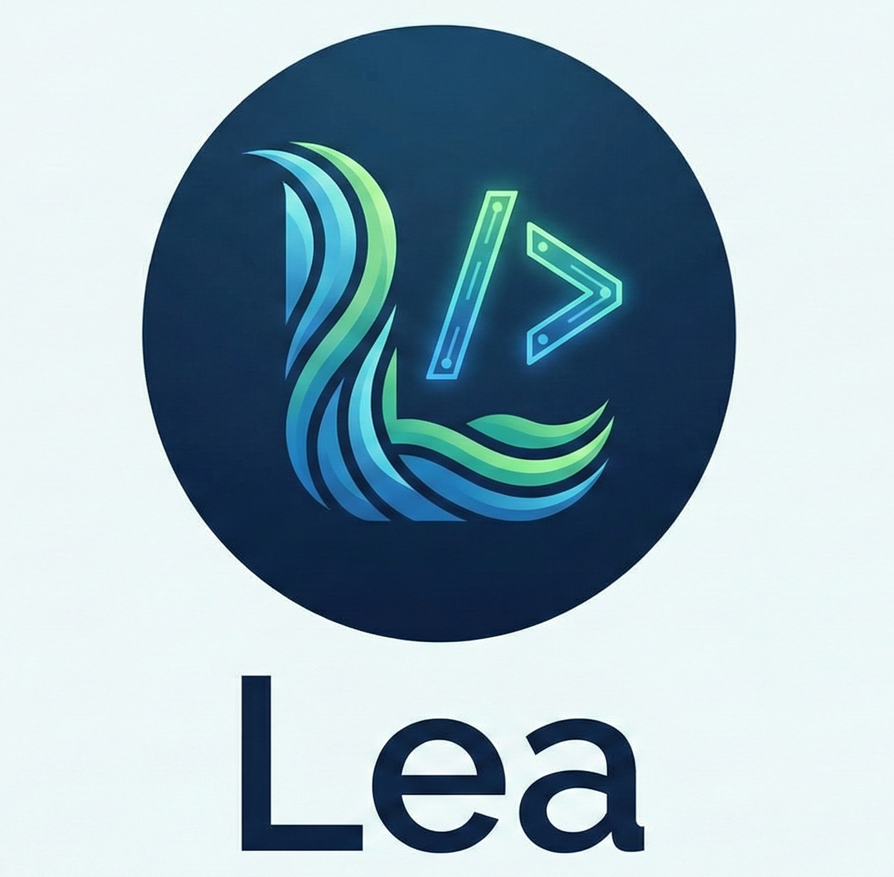

# Lea Language Support for VS Code

Syntax highlighting for [Lea](https://github.com/mcclowes/lea) — a pipe-oriented functional programming language.



## Features

- Syntax highlighting for `.lea` files
- Comment toggling with `--`
- Auto-closing brackets and quotes
- Indentation support for function bodies

## Highlighted Elements

| Category | Elements |
|----------|----------|
| Keywords | `let`, `mut`, `await`, `context`, `provide` |
| Operators | `/>` (pipe), `->` (arrow), `<-` (return), `++` (concat) |
| Decorators | `#log`, `#memo`, `#time`, `#retry`, `#async`, etc. |
| Attachments | `@Context` |
| Builtins | `print`, `map`, `filter`, `reduce`, `sqrt`, etc. |
| Literals | strings, numbers, `true`, `false` |

## Installation

**From VS Code Marketplace:**
1. Open VS Code
2. Go to Extensions (Ctrl+Shift+X / Cmd+Shift+X)
3. Search for "Lea Language"
4. Click Install

**From VSIX:**
```bash
code --install-extension lea-language-0.1.0.vsix
```

**For Development:**
```bash
ln -s /path/to/lea/vscode-lea ~/.vscode/extensions/lea-language
```

## Example

```lea
-- This is a comment
let numbers = [1, 2, 3, 4, 5]

let result = numbers
  /> filter((x) -> x > 2)
  /> map((x) -> x * x)
  /> reduce(0, (acc, x) -> acc + x)

result /> print

-- Function with decorators
let logged = (x) -> x * 2 #log #memo

-- Context system
context Logger = { log: (msg) -> print(msg) }

let greet = (name) ->
  @Logger
  Logger.log("Hello " ++ name)
```
